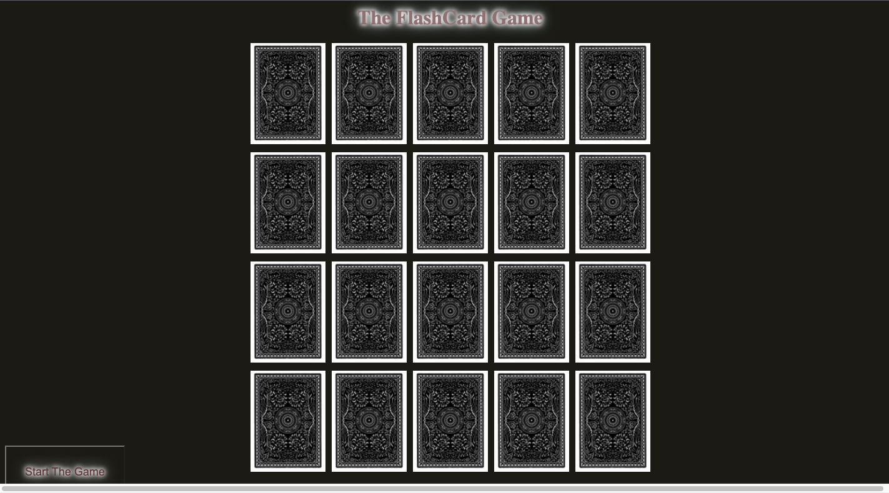

# FlashCard-Game
[Flash Card Memory game](https://en.wikipedia.org/wiki/Concentration_(card_game) also called as Concentration (card game). is a card game in which all of the cards are laid face down on a surface and two cards are flipped face up over each turn. The object of the game is to turn over pairs of matching cards. Concentration can be played with any number of players or as a solitaire or patience game. It is a particularly good game for young children, though adults may find it challenging and stimulating as well.

### Technologies used
-Javascript
-HTML
-CSS
-VS Code
-Chrome Browser
-GitHub

### Limitation
> Only tested on Goggle Chrome
> Not Mobile Friendly

### Enjoy !
